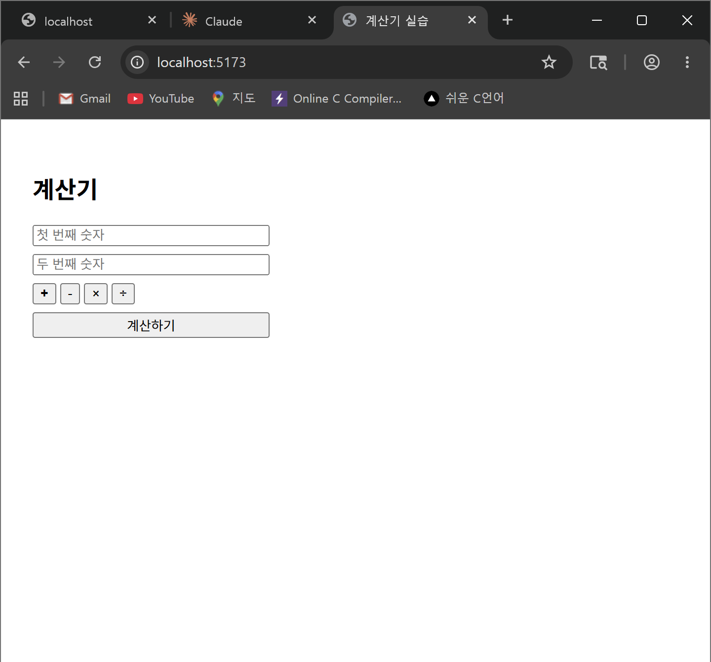
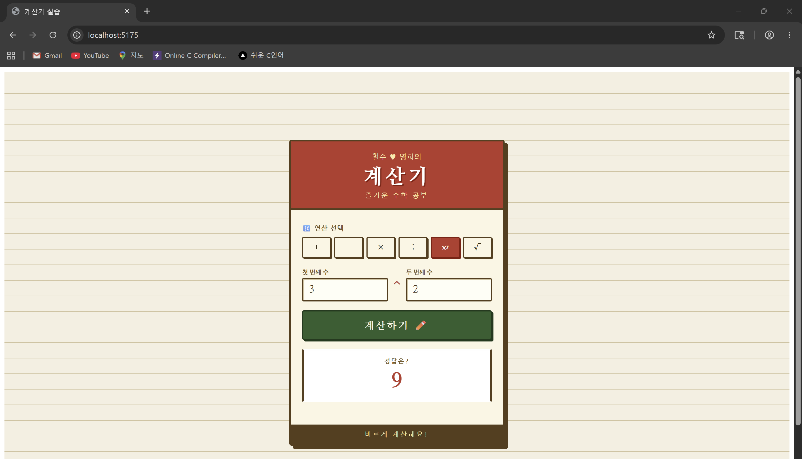
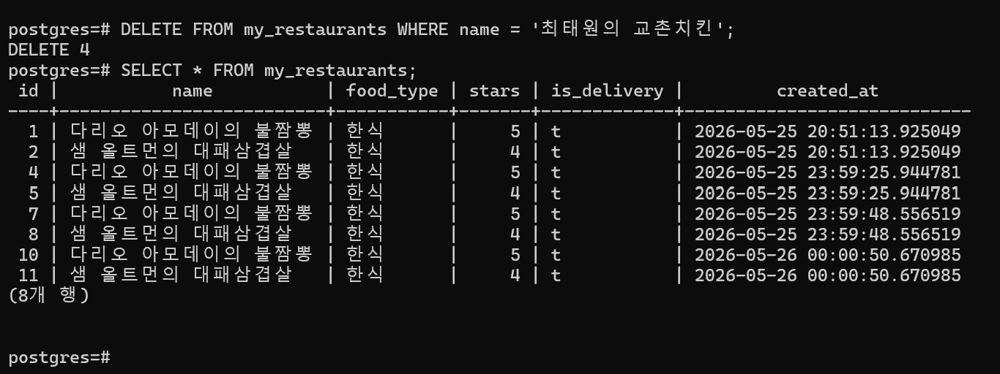
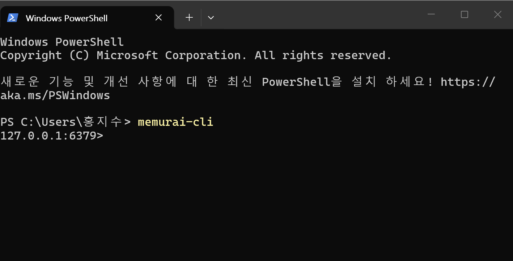
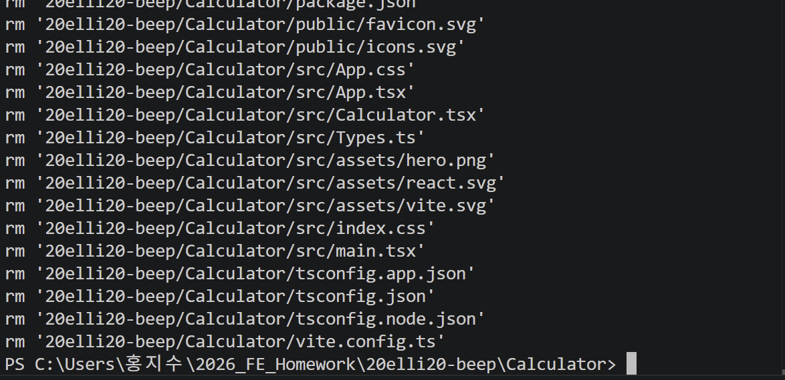
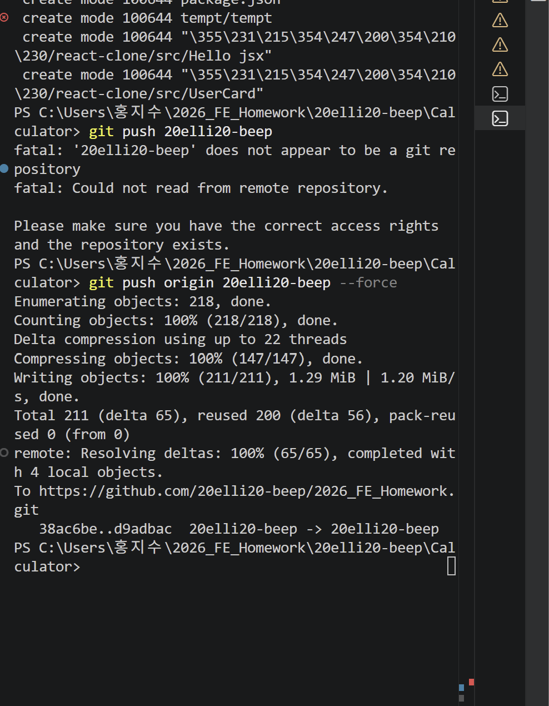
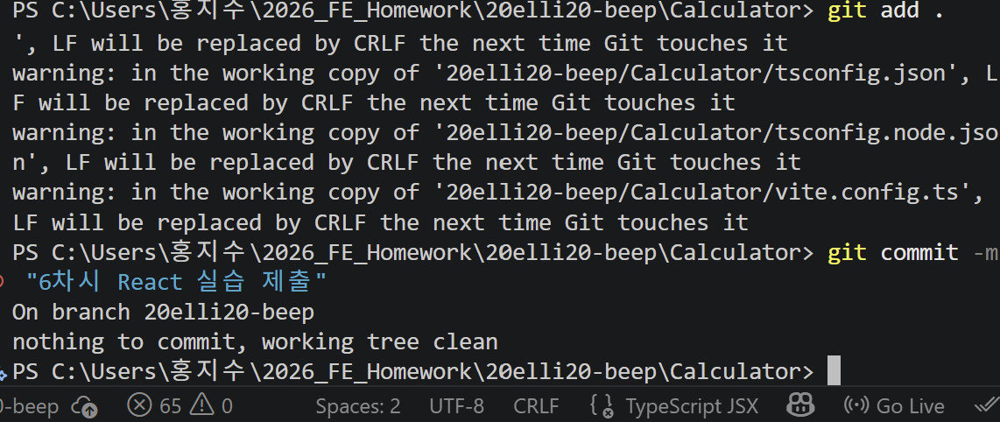
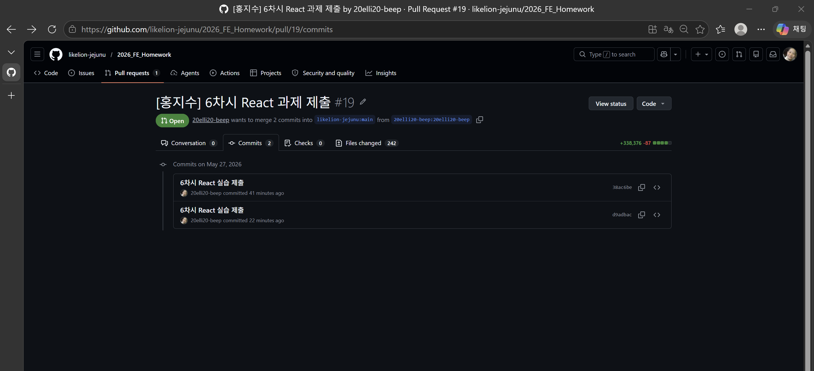

# 📘 Today I Learned

### 1. 오늘 배운 내용

- Typescript
    - JavaScript의 동적 타이핑 문제를 해결하기 위한 정적 타입 시스템과 구조적 타이핑의 이해.
    - 변수 선언 시 초기값을 바탕으로 타입을 자동으로 지정해 주는 '타입 추론' 메커니즘과 명시적 타입 선언의 균형 학습.

- 서버 & 데이터베이스
    - 관계형 데이터베이스(RDBMS)인 PostgreSQL을 이용한 스키마 설계 및 SQL 쿼리문(CRUD) 실습.
    - 비관계형 데이터베이스(NoSQL)이자 인메모리 기반 키-값 저장소인 Redis의 개념 및 동작 확인.

### 2. 핵심 정리 (내 언어로)

- 모든 변수에 일일이 타입을 적는 것은 생산성을 떨어뜨리기 때문에 TypeScript가 스스로 알 수 있는 부분(예: let count = 0)은 자동으로 추론하게 두고, 추론이 불가능한 상황에서만 명시적으로 타입을 지정해 주는 것이 효율적이다.

- PostgreSQL은 데이터가 엑셀 표 형태로 엄격하게 관리되어 가독성이 좋고 데이터 간의 정합성을 유지하기 유리하다.

- Redis는 하드디스크가 아닌 메모리에 데이터를 올려 속도가 극도로 빠르며, 특정 시간이 지나면 데이터가 자동으로 소멸하는 '시한부(TTL)' 관리가 가능하다

### 3. 실습 / 과제 / 결과물
- 코드:TypeScript 계산기 React 실습 화면
- 링크: https://github.com/likelion-jejunu/2026_FE_Homework/pull/19/changes/d9adbac5d64743369d53b98ee83d334e3c15ca9b
- 스크린샷:

- 코드:PostgreSQL, Redis 다운로드 화면 및 실습 화면
- 스크린샷: 

<PostgreSQL>

만 골라서 보기.png>)

!

<Redis>

.png>)
.png>)

### 4. 느낀 점 & 다음 계획

- 윈도우 환경에서 PostgreSQL과 Redis 명령어를 터미널이 인식하지 못하는 문제가 있었는데 AI와 함께 원인 분석 및 해결방안에 대해서 나름 같이 이야기 해봣는데  원인을 분석해 보니 OS가 해당 프로그램의 실행 파일 경로를 찾지 못했기 때문이었다. 시스템 환경 변수(Path)에 C:\Program Files\PostgreSQL\14\bin 등 경로를 등록해 줌으로써, OS가 왜 환경 변수를 필요로 하는지와 터미널 환경의 동작 원리에 대해 5주차보다 더 구체적으로 알 수 있었다. 

- PostgreSQL 실습하는 과정에서 동일한 INSERT 쿼리를 여러 번 중복 실행하는 실수를 저질러서 테이블 내에 동일한 맛집 데이터가 누적 생성되는 현상을 겪었당... 데이터를 삽입하기 전에 기존 데이터를 확인하는 로직이 왜 필수적인지 뼈저리게 체감할 수 있었다..

- 눈에 보이지 않던 데이터의 흐름이 PostgreSQL을 통해 엑셀 표처럼 시각적이고 구조적으로 정돈되어 나타나는 과정이 나름 시원했다.. 특히 Redis의 '시한부 데이터' 개념은 추후 서비스의 인증 토큰이나 실시간 데이터 캐싱을 구현할 때 왜 Redis를 선택해야 하는지에 대한 강력한 근거를 제시해 주었던것 같다. 프론트엔드와 백엔드의 접점을 이해할 수 있어 지금까지의 세션 중 가장 흥미로웠던 것 같다.

- 이번에 깃허브로 React 실습 과제를 commit 하는 과정에서 우여곡절이 너무 많았다.. 이번주 목요일에 하는 깃허브 세션에서 위 고충을 보완할 정도의 실력을 가지고 싶다!

    
    
    
    