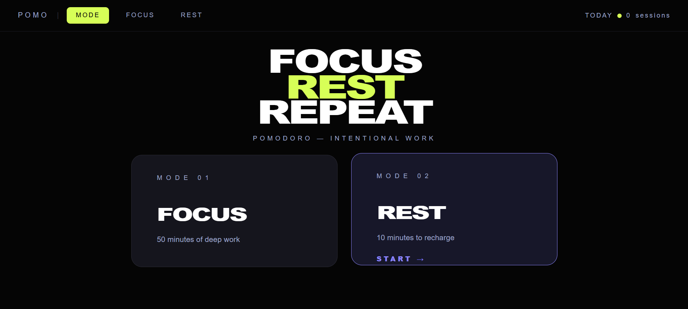

# 📘 Today I Learned

### 1. 오늘 배운 내용
- React의 생명주기(Lifecycle)
- Hook의 개념과 종류
- useState와 useEffect 사용법
- React Router 구조 및 페이지 이동 방식
- SPA(Single Page Application)의 동작 원리
- useNavigate, useParams 활용법

### 2. 핵심 정리 (내 언어로)
- React 컴포넌트는 Mount → Update → Unmount의 생명주기를 가진다.
- 후킹 : 함수 호출, 메시지, 이벤트 등을 중간에서 바꾸거나 가로채는 행위
- Hook : 함수 컴포넌트에서 React State와 생명주기 기능을 연동할 수 있께 해주는 함수
- useState는 값이 바뀌면 화면이 자동으로 다시 렌더링되기 때문에, 화면과 연결되는 데이터를 관리할 때 사용한다.
- useEffect는 특정 시점에 코드를 실행하기 위한 Hook이며, 의존성 배열에 따라 실행 시점이 달라진다.
- setInterval을 사용할 때는 clearInterval로 정리(cleanup)를 해줘야 메모리 누수를 막을 수 있다.
- React는 기본적으로 URL을 인식하지 못하기 때문에 React Router를 사용해서 URL마다 다른 컴포넌트를 보여준다.
- Link는 사용자가 클릭해서 이동할 때 사용하고, useNavigate는 특정 조건에서 코드로 페이지를 이동시킬 때 사용한다.
- Context를 사용하면 props를 여러 단계로 전달하지 않아도 전역 데이터를 공유할 수 있다.

### 3. 실습 / 과제 / 결과물

### 4. 느낀 점 & 다음 계획
- 오늘은 React가 왜 상태(state)를 사용하는지 조금 더 이해할 수 있었다.
- 특히 useEffect는 처음엔 어렵게 느껴졌지만, 생명주기와 연결해서 생각하니 흐름이 이해됐다.
- React Router를 배우면서 React가 새로고침 없이 동작하는 이유도 알게 되었다.
- 다음에는 Context와 Router를 더 자연스럽게 사용하는 연습을 해보고 싶다.