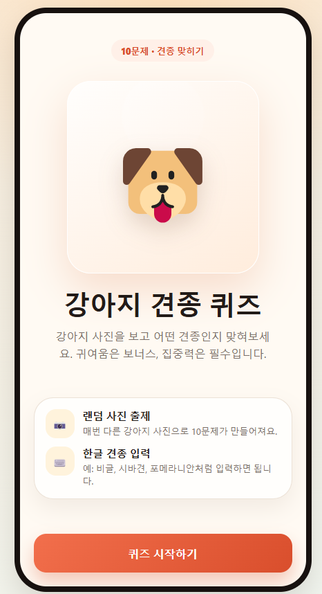
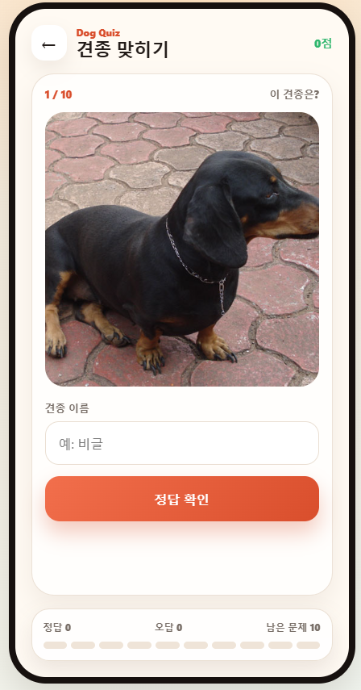

# 📘 Today I Learned

### 1. 오늘 배운 내용
- API
- 리액트
- 비동기

### 2. 핵심 정리 (내 언어로)
- 리액트: 데이터가 흐르는 통로와 사용자가 움직이는 지도(라우팅)

- API (Application Programming Interface) : 클라이언트가 서버에게 데이터를 요청할 때 지켜야 하는 메뉴얼. 어떤 주소로 어떤 방식으로 요청하면, 어떤 데이터를 줄게 라는 약속

- 리액트에서 API 호출하기
  1. 페이지가 열리자마자 자동으로 정보를 가져올 것인가? : useEffect  내부에서 호출 
  2. 사용자가 버튼을 눌렀을 때 가져올 것인가? : 이벤트 핸들러 내부에서 호출
 
- 비동기 통신
    1. fetch: 서버에 데이터를 요청
    2. async (비동기 선언) : 함수 앞에 붙임
    3. await(기다림) 
    4. 장점 : 코드가 매우 직관적으로 변하며, 데이터를 다루기가 훨씬 수월

- .env 파일: API키 노출 방지를 위해서
- 주의사항: .env 파일을 만들었다면 반드시 .gitignore 파일에 .env를 추가하여 깃허브에 업로드되지 않도록 해야 한다.'
- 

### 3. 실습 / 과제 / 결과물
- 스크린샷

### 4. 느낀 점 & 다음 계획
- .env파일 (gitignore)에 대해 들어는 봤지만 실제로 사용해본 것은 처음이었다. 이번 캡스톤 조별과제 할 때 필요한 작업이었는데 미리 할 수 있어서 더 좋은 경험이었습니다.
- API 관계에 대해서 좀 더 자세히 알 수 있었다.