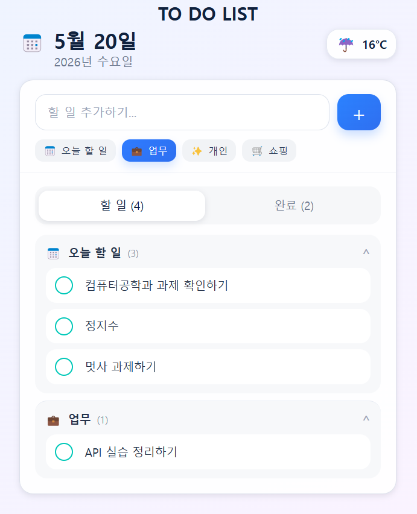
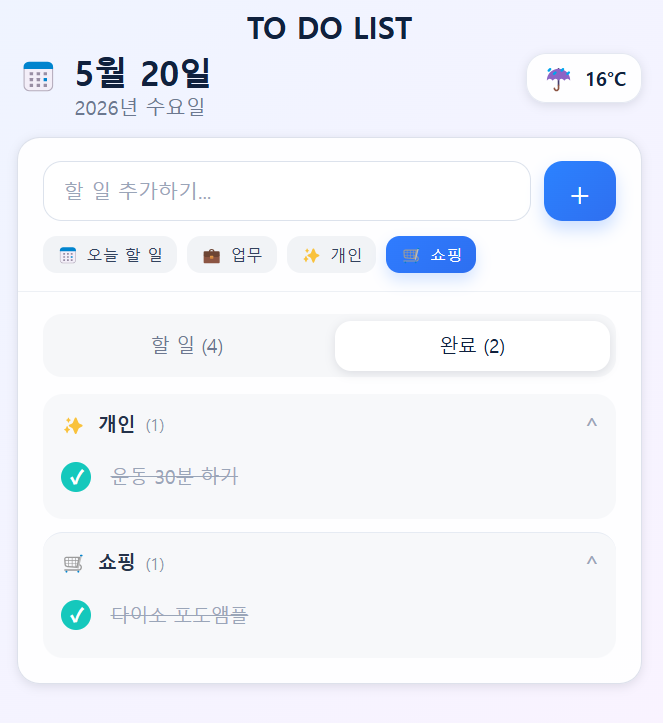

# 📘 Today I Learned

### 1. 오늘 배운 내용
-API; 일련의 규칙
-API 유형
-웹 API 
-REST API
-상태코드
-POSTMAN

### 2. 핵심 정리 (내 언어로)
[API란?]
  : 특정 자원(Apllication)을 원하는대로 명령(Programming)할 수 있도록 도와주는 매개체(Interface)
- 인터페이스란?
  : 서로 다른 두 개체가 상호작용 할 수 있도록 도와주는 매개체
- 통신 구조
  : 클라리언트 > API 요청 > 서버
  : 서     버 > API 응답 > 클라이언트
- API 유형 : Web API, 데이터 API, 원격 API
- Web API 유형 : REST, GraphQL, WebSocket, SOAP, gRPC
- 왜 필요할까?
  : 시스템 연결 및 통합, 보안 강화, 개발 생산성 향상 등

[REST란?]
  : 웹 API 아키텍처의 원칙과 설계 방식을 정의한 스타일
- 구성 : 자원(URI) - 행위 (HTTP METHOD) - 표현
- 규칙 : URI는 정보의 자원을 표현
        자원에 대한 행위는 HTTP Method로 표현

[자주 보는 상태 코드: Status Code]
- 200 OK : 요청이 정상적으로 처리됨
- 201 Create : 요청이 성공적으로 처리되어 리소스가 새로 생성됨
- 401 Unauthorized : 인증이 필요하거나 인증 실패
- 403 Forbidden : 서버가 요청을 이해했지만 권한 부족 등으로 거부
- 404 Not Found : 요청한 리소스를 찾을 수 없음
- 502 Bad Gateway : 게이트웨이/프록시 서버가 잘못된 응답을 받음

- 1XX	/ 정보
- 2XX	/ 성공
- 3XX	/ 리다이렉션
- 4XX	/ 클라이언트 오류
- 5XX	/ 서버 오류

[데이터 제공 형식]
  : 데이터를 추출하기 위해 API를 통하여 JSON, XML과 같은 구조화된 형식의 데이터를 가져올 수 있따

[JSON]
  : 자바스크립트 객체 문법으로 구조화된 데이터를 표현하기 위한 문자 기반의 표준 포맷
- HTML, Java, React → 코드르 저장하고 실행하기 위한 포맷
- JSON, XML → 데이터 교환 하고 저장하기 위한 포맷

[XML]
- 마크업 언어
- 데이터를 보여주지 않고, 데이터 전달 & 저장만을 목적으로 함

[API 명세서]
- API가 어떻게 이루어져 있는지 자세히 적어놓은 문서
- 백엔드-프론트엔드가 데이터를 주고받기 위해 미리 정해놓은 약속 문서

[Postman]
- postman은 로컬에서 돌아가는 프로그램
- 백엔드가 서버를 띄우기 전에 로컬에서 테스트용으로 씀

### 3. 실습 / 과제 / 결과물

### 4. 느낀 점 & 다음 계획
- 캡스톤에서 로컬 테스트로 사용 해본 적 있었는데 여기서 쓰니깐 또 색달랐습니다.
- 상태코드와 JSON, XML 등  어렴풋이 알고는 있었는데요. 누구한테 설명 하라고 하면 못 할 정도의 지식이었는데, 이제는 누군가가 물어본다면 당당하게 설명할 수 있을 거 같습니다ㅎㅎ!...아마도...?