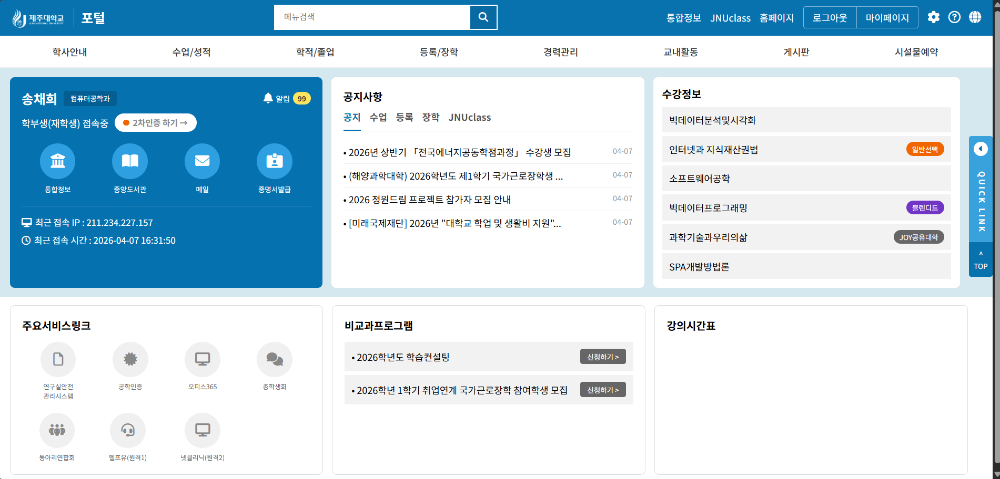

# 📘 Today I Learned

### 1. 오늘 배운 내용
- 1회차 세션 내용을 상기하며.. React로 제주대학교 포털 사이트를 클론코딩 했습니다

### 2. 핵심 정리 (내 언어로)
- 우선 문법을 잘 몰라 97%정도는 AI의 도움을 받아 과제를 제출하였다. 
- AI의 도움을 많이 받긴 했지만 초기 작업환경 설정이라던가, 세부 수정, git에 push하며 코딩과 친해지고 있다. 
- 아무래도 AI라 그런가 색상코드가 부정확한 경우가 많았다 코드를 직접 추출해서 알려주니 더 정확한 결과물이 나왔다.
- 제주대 포털 사이트에는 다양한 아이콘이 있었다. Font Awesome에서 아이콘을 직접 찾아 코드를 수정했다. AI보다 직접 사이트에서 검색하는 게 더 정확했다.
- git push 할 때 브랜치 이름이 Username으로 설정되어 있었어서 에러가 발생했다. git branch로 확인 후 올바른 이름(haaaaaaayu)으로 push 했다. 
- 정렬이나, 간격 같은 CSS 디테일을 조정할 때 정확히 "어느 부분을 수정해야겠다"가 아닌 "음.. 여긴가?" 하면서 직감(?)으로 클로드가 짜준 코드를 수정해나갔다. 
- 방금 이거 작성하면서도 마크다운에서 사진 첨부하는 방법을 배웠다...

### 3. 실습 / 과제 / 결과물
- 코드: React로 제주대학교 포털 메인 페이지 클론코딩
- 링크: https://github.com/haaaaaaayu/2026_FE_Homework
- 스크린샷: 

### 4. 느낀 점 & 다음 계획
- 처음으로 React 프로젝트를 만들어봤는데 생각보다 CSS 스타일링에 시간이 많이 걸렸다
- Git 사용법(fork, clone, branch, commit, push, PR)을 처음 배웠는데 아직 헷갈리지만 반복하면 익숙해질 것 같다
- 지금은 거의 모든것을 AI에게 물어보며 의존하고 있지만, 주차마다 발전하여 AI를 지혜롭고 적절하게 사용하고 싶다!