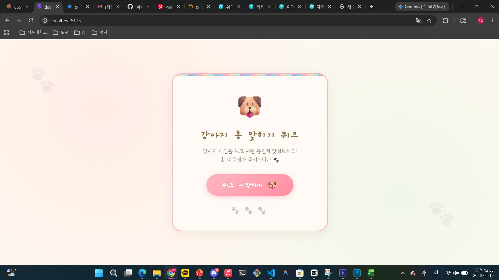
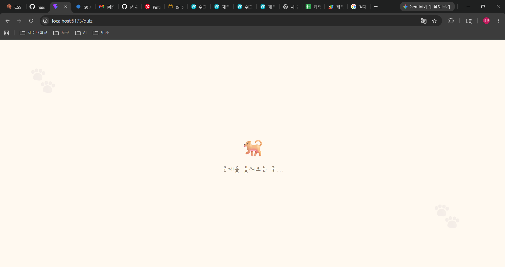
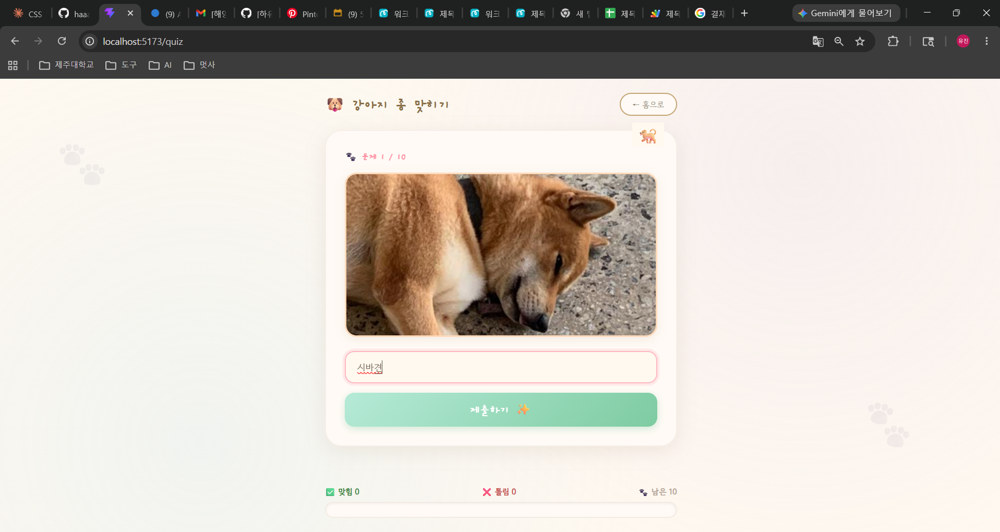
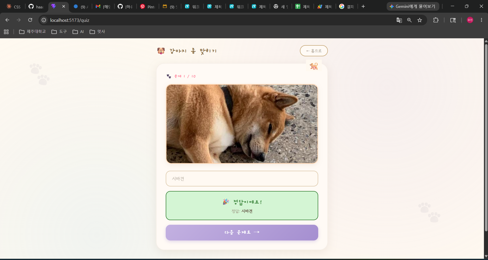
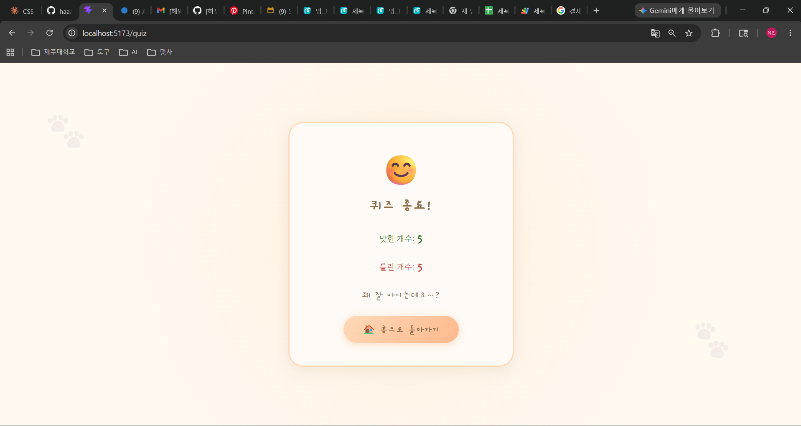

# 📘 Today I Learned

### 1. 오늘 배운 내용
- API 개념과 React에서 API 호출하는 방법 등

### 2. 핵심 정리 (내 언어로)
- API는 서버에 데이터를 요청하는 키!!
- 절대 API 키를 외부에 노출하면 안된다.... ".gitignore" 필수
- useEffect + 빈 배열([])로 페이지 로드 시 한 번만 API 호출
- API는 응답이 느릴 수 있어서 async/await으로 비동기 처리 (발음이 어렵다..)

### 3. 실습 / 과제 / 결과물
- 코드: 외부 강아지 사진 데이터를 이용한 강아지 종 퀴즈 페이지 제작
- 링크: https://github.com/haaaaaaayu/2026_FE_Homework
- 스크린샷: 
- 스크린샷: 
- 스크린샷: 
- 스크린샷: 
- 스크린샷: 
ㄴ
### 4. 느낀 점 & 다음 계획
- (조금 슬픈 이야기)
- 내가 프로그래밍을 아무것도 모르던 시절.... 가장 처음에 접했던 API는 Google map API 였다. 
- 구글 스프레드 시트의 확장 프로그램인 App Script와 Google map API 키를 활용하여 코드를 짰던 경험이 떠올랐다.
- 그때는 아무것도 몰랐고 쓰다보니 비용이 20만원 넘게 청구되어 어떻게 결재를 올려야 할지 발을 동동 굴렀던 슬픈 과거가 떠올랐다.
- 앞으로도 API 키를 다룰때는 조심하자! ^^;;
- 또한, 과제를 하려고 보니  react-router-dom 패키지를 설치해야 한다는 오류가 떠서 당황했다. 나는 분명 설치를 했는데ㅠ~ 알고보니 새 프로젝트에서는 패키지를 매번 다시 설치해야 한다는 걸 뒤늦게 알았다. 또 하나 배웠다. 
- CSS 스타일링은 AI 도움을 받아 귀여운 테마로 꾸며봤다^^