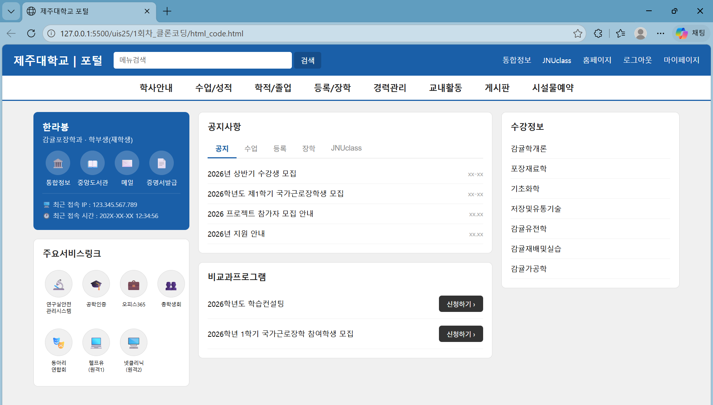

# 📘 Today I Learned

### 1. 오늘 배운 내용
- HTML과 CSS 기본 문법
- JavaScript와 함께 웹페이지 구성하기
- 리액트에 대한 정보

### 2. 핵심 정리 (내 언어로)
- 생성형 AI 프롬프트 작성 방법 
: RTF(Role, Task, Fomat)

- JavaScript 
: 웹페이지를 동적으로 변화시키는 프로그래밍 언어 
모든 브라우저에 JS 엔진 내장 
동적인 UI 구현 
서버 없이도 동작 가능(새로고침 안 해도 데이터 업데이트)

- 리액트 
: UI를 구축하는 JavaScript 라이브러리 
JS만 사용할 경우 유지보수가 어렵고 DOM 조작이 복잡함
-> 리액트를 통해 JS를 더 잘 활용할 수 있음! 또한 기존 JS와 함께 사용할 수 있음 
: 컴포넌트 구조 -> 기능을 분리해서 관리할 수 있어 독립적이고 재사용 가능 
: 가상 DOM 사용 / 단방향 데이터 바인딩
: JS + HTML(JSX) -> 코드의 가독성을 높임

- 브라우저 렌더링 
: DOM(HTML/CSS를 JS가 알아볼 수 있게하는 트리 구조) -> Render Tree -> Style -> Layout -> Paint -> Composite => Display! 
: JS는 DOM 조작해 화면의 요소를 변경 -> layout, paint 단계 반복 실행 
But 화면 요소가 변경되면서 리플로우/리페인트 발생 -> 연산량 증가

- 가상 DOM 
: 실제 DOM 접근X, 추상화한 JS 객체 구성 -> 필요한 부분만 실제 DOM에 업데이트 
: 상태 변화 -> 가상 DOM 생성 -> 변경 전/후 비교(Diffing) -> 실제 DOM에 최소한의 변경 사항 반영 
: 필요한 부분만 업데이트 되어 필요 없는 계산이 일어나지 않도록 함!

### 3. 실습 / 과제 ✅ / 결과물
- 코드:
- 링크: 
- 스크린샷: </img>

### 4. 느낀 점 & 다음 계획
- 고등학생 때, html과 css를 이용해서 <고등학교 홈페이지 재구성하기> 프로젝트를 진행한 적이 있었다. 당시에는 생성형 AI 활용이 보편적이지 않았을 때라 익힌 코드를 이용해서 직접 한 줄 한 줄 작성했기에 재구성한 화면이 크게 마음에 들지 않았었다. 하지만 지금은 생성형 AI를 같이 활용하며 내가 원하는 디자인 요소를 구성할 수 있어서 좋았다. 화면 구성이 생각한대로 되지 않아 코드를 계속 수정하다보면 시간이 많이 흘러 있는 경우도 있는데, 지금은 해보다가 안 되면 AI한테 도움을 요청할 수 있어서 다른 요소를 더 신경쓸 수 있었다. 그때 당시에도 이번 과제처럼 정적인 화면으로만 구성했어서 다음 번에는 자바스크립트와 앞으로 배울 리액트 등을 활용해서 동적인 웹페이지를 꼭 제작해 보고 싶다!!