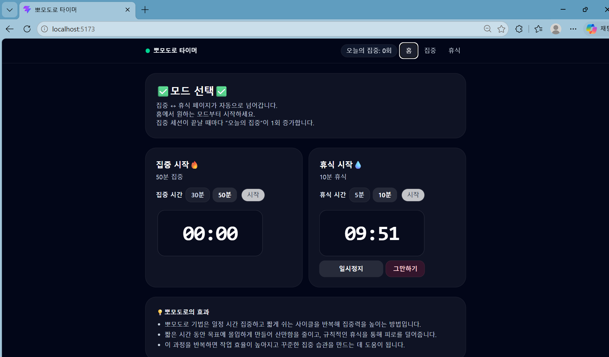
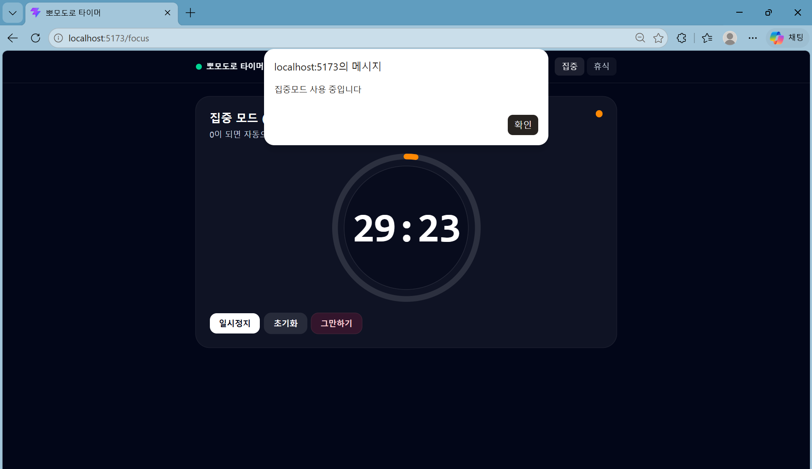

# 📘 Today I Learned

### 1. 오늘 배운 내용
- React 생명주기
- Hooking
- React Router

### 2. 핵심 정리 (내 언어로)
- React 생명주기<br>
: Mount / Update / Unmount 3단계로 이루어짐<br>
Mount는 DOM에 컴포넌트가 추가될 때, Update는 변경이 생길 때, Unmount는 컴포넌트가 제거되기 직전에
- Hooking
: 호출 흐름을 중간에서 바꾸거나 가로채는 행위<br>
React Hook
: React State와 생명주기 기능 연동 함수<br>
컴포넌트 최상위에서만 호출해야하며, React 함수형 컴포넌트 안에서만 호출해야 함<br>
값이 바뀌어서 화면도 바뀌어야 할 때 유용<br>

1. useStates: state 관리<br>
const [state(현재값), setState(값변경함수)] = useState(초기값)

2. useEffect: 생명주기 관리<br>
useEffect(() => {...})<br>
=> 화면에 나타나고 바뀔 때 실행(Mount + Update)<br>
useEffect({...}, [])<br>
=> 처음에만 실행(Mount)<br>
useEffect({...}, [value])<br>
=> 값이 바뀔 때 실행(Update)<br>
useEffect(() => {return () => {...} }, [])<br>
=> 컴포넌트가 제거되기 직전에 실행(Unmount)<br>

3. useRef: DOM 직접 접근/ 4. useContext: 전역 상태 접근 / 5. useMemo: 값 캐싱 / 6. useCallback: 함수 캐싱

- SPA와 일반 웹사이트<br>
: 일반 웹사이트는 각 페이지마다 HTML 파일이 있는 반면, SPA는 하나만 있다(JavaScript로 화면을 바꿈).
- React Router<br>
: URL을 인식하지 못하는 React의 단점을 보완.<br>
URL 변경을 감지 해서 매칭되는 컴포넌트 렌더링<br>
=> 새로고침 없이 화면 교체를 한다!!<br>

```
import { BrowserRouter, Routes, Route } from 'react-router-dom'

function App() {
  return (
    <BrowserRouter>
      <Routes>
        <Route path="/" element={<Home />} />
        <Route path="/about" element={<About />} />
        <Route path="/post/:id" element={<Post />} />
        <Route path="*" element={<NotFound />} />
      </Routes>

    </BrowserRouter>
  )
}
```
path가 현재 URL과 일치하면 element를 렌더링해서 화면에 보여줌!

### 3. 실습 / 과제 / 결과물
- 코드:
```
useEffect(() => {
    try {
      const raw = localStorage.getItem(STORAGE_KEY);
      if (!raw) return;
      const parsed = JSON.parse(raw);
      if (parsed?.date === todayKey() && typeof parsed?.completedSessions === 'number') {
        setDate(parsed.date);
        setCompletedSessions(parsed.completedSessions);
      }
    } catch {
    }
  }, []);

  useEffect(() => {
    const t = todayKey();
    if (date !== t) {
      setDate(t);
      setCompletedSessions(0);
    }
  }, [date]);
  ```
```
  function ModeCard({ title, subtitle, className, children }) {
  return (
    <div className={['rounded-3xl bg-white/5 p-6 ring-1 ring-white/10', className].join(' ')}>
      <div className="flex items-start justify-between gap-4">
        <div className="min-w-0">
          <div className="text-lg font-semibold tracking-tight text-white">{title}</div>
          <div className="mt-1 text-sm text-slate-300">{subtitle}</div>
          {children ? <div className="mt-4">{children}</div> : null}
        </div>
      </div>
    </div>
  );
}
```
- 스크린샷
</img>
</img>

### 4. 느낀 점 & 다음 계획
- 새로고침을 하지 않아도 화면이 바뀌는 원리를 React Router를 통해 알게 되는 시간이었다. 새로고침 없이 변경되는 값을 인지해서 바로바로 화면으로 출력을 한다는 것이 신기했다. 평상 시에는 자연스럽고 당연하게만 느껴졌던 것의 원리를 배우면서 이제 나도 이런 기능을 구현해 낼 수 있다는 것에 작은 기대를 품게 되었다. 타이머 만들기 실습을 하면서 css 파일을 따로 생성하지 않아도 스타일을 꾸밀 수 있다는 것을 처음 알게 되기도 했다. 웹 페이지 제작 능력을 기르는 연습도 할 겸 여러 기능을 체험해 보면서 많은 페이지를 제작해 보고, 만든 웹 페이지를 친구들한테 선물해 보고 싶다.