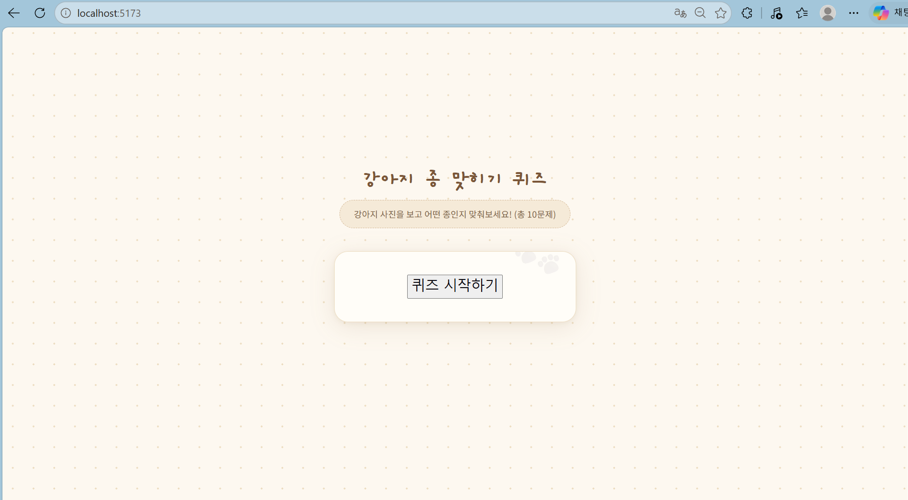

# 📘 Today I Learned

### 1. 오늘 배운 내용
- API
- 비동기 통신

### 2. 핵심 정리 (내 언어로)
- API(Application Programming Interface) 
: 클라이언트(요청)가 서버(응답)에게 데이터를 요청할 때 지켜야 하는 메뉴얼. 어떤 방식으로 요청하면 어떤 데이터를 줌. 
: Base URL(모든 요청에 공통으로 들어가는 주소)와 Endpoint(가져오고 싶은 구체적 경로)로 구성 됨.
- React에서 API 호출하기 
자동으로 가져와야 할 떈? 
-> useEffect 내부에서 호출 
: 사용자가 별도로 클릭하지 않아도 화면에 데이터가 보여야 할 때 Mount 시 리액트가 예약해둔 작업 수행. 
사용자가 원해서 가져올 땐? 
-> 이벤트 핸들러 
: 사용자의 특정 행동이 있을 때 이벤트 속성에 연결된 함수 내부에서 호출
- 비동기 통신
1. fetch: fetch를 호출하면 브라우저가 즉시 서버에 요청 => promise 반환
2. async: 함수 앞에 붙여 '이 함수는 비동기적으로 작동하며 항상 promise를 반환한다'는 것을 의미
3. await: promise가 완료될 때까지 기다렸다가 그 데이터를 뽑아서 변수에 할당
- .env 파일 
: API 키는 일종의 비밀번호이므로 키를 노출해서는 안 됨. 프로젝트 최상단 폴더에 .env 파일에 키 값을 두고, .gitignore 파일에 추가하여 키 값이 보이지 않게 함.

### 3. 실습 / 과제 / 결과물
- 스크린샷
</img>
</img>
</img>
</img>

### 4. 느낀 점 & 다음 계획
- 단순 구현이 아니라 API를 사용해서 데이터를 가져와 개발을 하니 진짜 개발을 하는 느낌이 났다. API 키를 받아오려면 대부분 유료라는 점이 아쉽다. 앞으로의 프로젝트에서는 데이터와 연동을 자주 할텐데 미리미리 연습해둘 필요가 있는 것 같다.