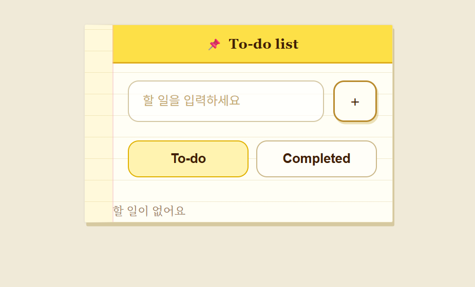
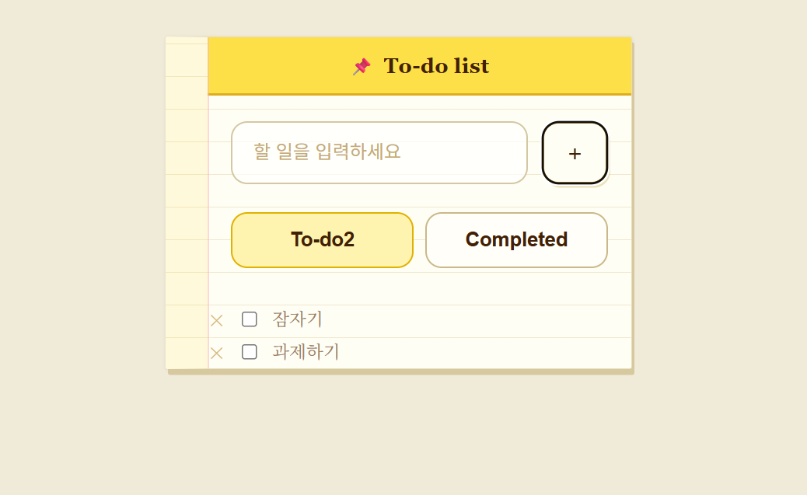
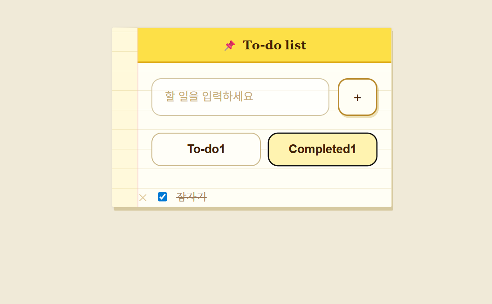

# 📘 Today I Learned

### 1. 오늘 배운 내용
- API
- JSON
- XML
- API 명세서

### 2. 핵심 정리 (내 언어로)
- API(Application Programming Interface) 
: 소프트웨어 어플리케이션이 서로 통신하며 데이터와 특징 및 기능을 교환할 수 있도록 하는 프로토콜 
Application - 특정자원 / Programming - 명령 / Interface - 매개체
통신 구조: 클라이언트(API 요청) ----> 서버(API 응답) 
- Web API - REST API 
: 웹 API 아키텍처의 원칙과 설계 방식을 정의한 스타일 
: URL(정보의 자원을 표현) - 인터넷 상에서 자원을 식별하는 고유한 주소 
: HTTP METHOD(자원에 대한 행위) - 클라이언트 서버 간의 상호작용을 정의 
POST(리소스 생성), GET(리소스 조회), PUT(리소스 수정), DELETE(리소스 삭제) 
: 상태 코드(요청 처리가 어떻게 됐는지 숫자로 알려줌) 
1XX - 정보 / 2XX - 성공 / 3XX - 리다이렉션 / 4XX - 클라이언트 오류 / 5XX - 서버 오류 
- 데이터 제공 형식
1. JSON(JavaScript Object Notation): 자바스트릭트 객체 문법으로 구조화된 데이터를 표현하기 위한 문자 기반의 표준 포맷. { 키: 값 } 쌍의 구조 
2. XML(Extensible Markup Language): 데이터를 정의하는 규칙을 제공하는 마크업 언어. 데이터를 전달하고 저장만 함. 
- API 명세서 
: API가 어떻게 이루어져 있는지 자세히 적어놓은 문서. 백엔드-프론트엔드가 데이터를 주고 받기 위해 미리 정해놓은 문서

### 3. 실습 / 과제 / 결과물
- 스크린샷
</img>
</img>
</img>

### 4. 느낀 점 & 다음 계획
- 백엔드가 데이터를 완성할 때까지 프론트엔드는 가만히 기다려야 한다면 백엔드가 늦게 데이터를 전달해줄 때 조급해질텐데, 데이터를 주기 전 데이터가 있다고 생각하고 미리 작업을 해둘 수 있다는 점이 좋았다. 실행페이지에서 할 일을 추가, 삭제할 때마다 db.json 파일에 데이터가 추가되고 삭제되는 게 실시간으로 되는 게 신기했다. 이런 데이터는 평상 시에 눈으로 직접 볼 수 없다보니 코딩할 때 이런 부분까지 볼 수 있다는 게 흥미롭다.