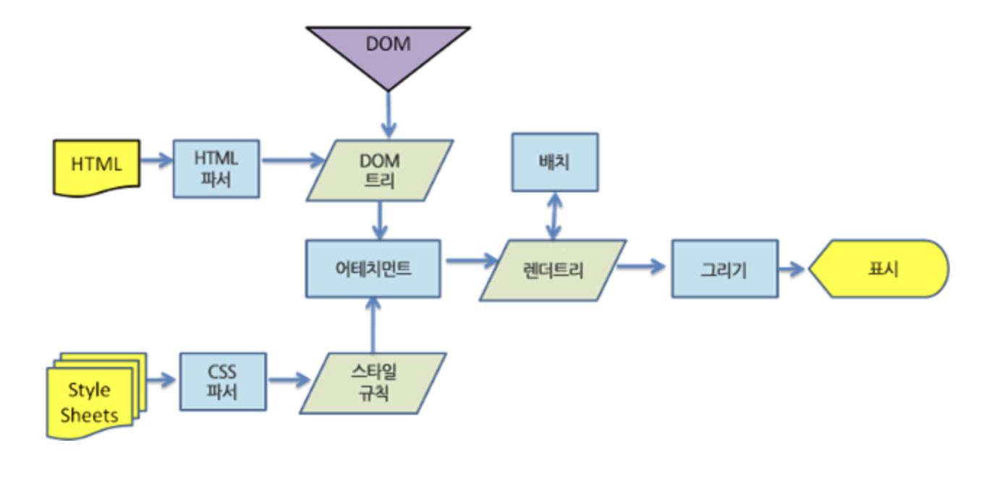

# 1회차 TIL

## 1. 오늘 배운 내용

### 프롬프트 엔지니어링

- **Few-Shot** Learning : 모델에게 예시를 보여준 뒤 답변 패턴을 보여주기
- **RTF** Framework : Role + Task + Format

### 왜 React?

<aside>

1. **컴포넌트** 기반 구조
2. 가상 DOM : 성능 최적화 위해
3. **단방향** 데이터 바인딩 : 데이터 흐름이 부모 → 자식 한 방향으로
4. **JSX** (JS + HTML)
5. React Hooks : 함수형 컴포넌트 상태와 라이프 사이클 메서드
6. 강력한 커뮤니티 생태계
</aside>

### 왜 Javascript 라이브러리로 만들어졌는가?

- 동적인 화면 구현. UI를 상태기반으로 자동 관리
- JS : 유지보수 어려움. DOM 조직 복잡함
    
    → 라이브러리의 특징. 기존 JS와 함께 사용 가능
    

복잡한 UI를 더욱 잘 관리하기 위해 / 필요할 때 가져다 쓸 수 있는 구조. 

### 브라우저 렌더링 과정

브라우저 성능을 최적화하기 위해 수행

1. DOM + CSSOM을 결합해서 Render Tree를 생성한다
2. style 단계 : 각 요소에 최종 CSS 스타일을 계산
3. layout 단계 : 각 요소의 위치와 크기를 계산
4. paint 단계 : 각 요소의 스타일과 내용을 바탕으로 픽셀 데이터를 이용해 화면을 그림
5. 컴포지팅 단계 : 페인트 과정에서 생성된 여러개의 레이어를 하나의 화면으로 결합

JS는 DOM을 조작해 화면의 요소를 변경하거나 추가한다. 

Virtual DOM(가상 DOM) : 필요한 부분만 실제 DOM에 업데이트하는 방식

Virtual DOM 생성 (가상 DOM 트리로 저장) → diffing(변경 전 후 상태 비교하여 변경사항 감지) → 실제 DOM 업데이트 (최소한의 변경 사항 반영)

## 2. 핵심 정리

- 프롬프트 엔지니어링을 할 때는 잘! 시켜야한다.
    
    **잘** = 정확한 가이드를 주고, 예시를 통해 내가 원하는 결과물에 잘 도달할 수 있도록 한다. 
    
    내가 기존에 하던 프롬프트 엔지니어링을 되돌아보면
    
    <aside>
    
    - 내 파일을 읽고 너가 알아서 정리해줘. 최대한 깔끔하고 쉽고 알아볼 수 있게..
    - 디자인 예쁘게 바꿔줘.. 최대한 예쁘게.. 배경은 흰 색으로 간결한 디자인..
    </aside>
    
    이런 수준이었던 것 같다. 
    
    최근에는 md파일로 작업지시서를 만들고 할 일을 상세하게 시키기 시작했더니 AI가 이해하는 수준이 높아진 것 같다고 느꼈다. 
    
    더욱 프롬프트 엔지니어링을 고도화시켜서 최고의 성능을 뽑아낼 수 있도록 해야겠다!
    
- HTML 기초에 대해 배웠다.
    - Non-sementic 태그 : <div> </div>
        - class를 확인해야 의미를 알 수 있다.
    - Semantic 태그  : 태그만 봐도 구조를 알 수 있다.
        - **<nav>** 주요 이동 링크
        - **<main>** 문서의 핵심 내용
            - **<section>** 관련 콘텐츠를 묶기
            
            ```html
             <section id="hobby">
                    <h2>취미 목록</h2>
                    <!-- ul/li: 순서 없는 목록 -->
                    <ul>
                      <li>독서</li>
                      <li>운동</li>
                      <li>코딩</li>
                    </ul>
            
                    <!-- ol/li: 순서 있는 목록 -->
                    <h3>오늘의 학습 순서</h3>
                    <ol>
                      <li>HTML 태그 이해</li>
                      <li>CSS 선택자/박스모델 학습</li>
                      <li>JavaScript DOM 조작</li>
                    </ol>
                  </section>
            ```
            
        - **<form>** 사용자의 입력을 받음
            
            ```html
            <input id="name" type="text" placeholder="이름을 입력하세요" />
            ```
            
            type=”password” 로 바뀌면 비밀번호 입력하는 것처럼 안 보이게 된다. 
            
- CSS 기초에 대해 배웠다.
    - <link rel="stylesheet" href="style.css" /> 로 외부 CSS 파일로 연결
    - margin과 padding의 차이
        - margin은 안쪽으로 여백을 주고
        - padding은 바깥으로 여백을 만든다
    - max-width: 900px;
        - 자동대로 줄었다 늘었다를 할 수 있게 한다.
        - 무한대로 축소/확대되는 것을 막는 역할
    - primary-btn:hover
        - 가상 클래스(:hover) - 마우스를 올리면 보여지는 hover의 역할.. 색깔과 위치를 바꿀 수 있다.
        - primary-btn{ } 에서
        
        ```css
        transition: background-color 0.4s ease, transform 0.2s ease;
        ```
        
        바뀌는 데 딜레이를 줄 수 있다. 부드럽게 이동 가능!
        
- js 기초에 대해 배웠다
    
    ```
    <!-- 외부 JS 파일 연결 -->
    <script src="./assets/script-basics.js"></script>
    ```
    
    - 변수 선언
        - **const** clickBtn
        - **let** clickCount : 바뀌어야 하므로 let을 사용한다.
    - 이벤트 리스너 등록
        
        ```jsx
        clickBtn.addEventListener("click", function () {
          // 클릭할 때마다 숫자를 1 증가
          clickCount += 1;
        
          // 3) DOM 텍스트 업데이트
          clickResult.textContent = "버튼을 " + clickCount + "번 클릭했습니다.";
        });
        ```
        
        - 조건문을 통해 ```numResult.textContent = “내가 하고 싶은 말” ``` 가능.
        
        <aside>
        
        - **DOM**은 HTML 문서를 자바스크립트가 객체처럼 다룰 수 있게 만든 구조인데
        - DOM 텍스트 업데이트란? DOM 요소 안의 텍스트를 수정하는 것
        - 왜 DOM 업데이트가 필요할까? - 웹페이지를 **동적으로** 바꿔준다
        - 13버튼을 클릭하면 → textContent로 텍스트가 수정되고 → 클릭마다 화면 바뀜
        - **clickResult**가 DOM 요소. **textContent**가 요소 안의 글자
        - **clickCount**는 숫자 변수 (버튼을 몇 번 클릭했는지를 보여줌)
        </aside>
        

## 3. 실습 / 과제 / 결과물

1회차 세션을 진행하면서 DOM과 웹페이지 빌드에 대해 부족하다고 생각해서 찾아보게 되었다.

### DOM에 대해 더 알아보기

1. DOM이란? Document Object Model
    - 자바스크립트가 이해할 수 있는 객체 형태로 변환한 모델
    - DOM의 특성
        - 트리구조로 표현됨.
        - 라이브(live) 특성 : DOM에 대한 변경은 즉시 웹 페이지에 반영됨
        - 자바스크립트를 사용하여 DOM 요소 조작 가능
    - 주요 DOM 관련 메서드 및 속성
        
        ```markdown
        ** 구조 ** 
        document (HTML 전체)
         └── element (각 태그들)
              ├── element
              └── element
        ```
        
        - 요소 선택
            
            <aside>
            
            - document.getElementById(id): 주어진 ID를 가진 요소를 반환한다.
            - document.getElementsByTagName(name): 주어진 태그 이름을 가진 요소들의 목록을 반환한다.
            - document.getElementsByClassName(name): 주어진 클래스 이름을 가진 요소들의 목록을 반환한다.
            - document.querySelector(selector): 주어진 CSS 선택자와 일치하는 첫 번째 요소를 반환한다.
            - document.querySelectorAll(selector): 주어진 CSS 선택자와 일치하는 모든 요소의 목록을 반환한다.
            </aside>
            
        - 요소 조작
            
            <aside>
            
            - element.textContent 또는 element.innerText: 요소의 텍스트 내용을 가져오거나 설정한다.
            - element.innerHTML: 요소의 내부 HTML을 가져오거나 설정한다.
            - element.setAttribute(name, value): 요소의 속성 값을 설정한다.
            - element.getAttribute(name): 요소의 속성 값을 가져온다.
            - element.appendChild(childElement): 요소에 자식 요소를 추가한다.
            - element.removeChild(childElement): 요소에서 자식 요소를 제거한다.
            </aside>
            
        - 이벤트 리스너
            
            <aside>
            
            - element.addEventListener(event, function): 요소에 이벤트 리스너를 추가한다.
            - element.removeEventListener(event, function): 요소에서 이벤트 리스너를 제거한다.
            </aside>
            

### 웹페이지 빌드 과정

CPR (Critical Rendering Path) : 실제로 화면에 페이지를 표시하는 과정

- CRP의 주요 단계
    1. **DOM 트리 구축 (Constructing the DOM Tree)**
        
        브라우저는 HTML을 받아와서 DOM (Document Object Model) 트리라는 구조화된 표현을 만든다.
        
    2. **CSSOM 트리 구축 (Constructing the CSSOM Tree)**
        
        브라우저는 CSS를 받아와서 CSSOM (CSS Object Model) 트리라는 구조화된 표현을 만든다.
        
    3. **렌더 트리 생성 (Render Tree Construction)**
        
        DOM 트리와 CSSOM 트리는 합쳐져서 렌더 트리를 생성한다. 렌더 트리는 화면에 실제로 표시될 노드들만을 포함한다.
        
    4. **레이아웃 (Layout)**
        
        렌더 트리가 생성되면, 브라우저는 각 노드의 위치와 크기를 계산하는 레이아웃 과정을 거친다. 이를 "reflow"라고도 한다.
        
    5. **페인팅 (Painting)**
        
        레이아웃 단계 후, 브라우저는 렌더 트리의 각 노드를 화면에 그리는 페인팅 과정을 시작한다. 여기에는 텍스트, 색상, 이미지, 그림자 등의 세부 요소 그리기가 포함된다.
        
- CRP 최적화 단계
    1. 주요 경로(리소스 수, 바이트 수, 길이) 분석 및 파악
    2. 주요 리소스 수 최소화
        - 주요 리소스 제거
        - 리소스에 대한 다운로드를 연기 / 비동기로 표시
    3. 주요 바이트 수를 최적화하여 다운로드 시간 단축
    4. 나머지 주요 리소스가 로드되는 순서를 최적화

## 4. 느낀 점 & 다음 계획

1. 프롬프트 엔지니어링
    - 최근에 클로드 코드를 사용하면서 프롬프트 엔지니어링을 통해 토큰 사용량을 줄이는 방법에 대해 관심이 커졌는데, 결국 좋은 결과물을 내도록 하기 위해서는 좋은 지시가 따라야 한다는 것을 느꼈다.
    - 프롬프트를 작성할 때 RTF 프레임워크를 잘 사용하고, 차근차근 체계적으로 질문하는 습관을 들여야겠다.
    - Zero-shot이 아닌 Few-shot으로!
2. 브라우저 동작 과정
    - 이제까지는 브라우저가 어떻게 동작하고 사용자에게 어떻게 보여지는지에 대해 관심을 가지지 않았던 것 같다.
    - 웹 프로그램을 만들면서 웹에 대해 이해하려고 하지 않았다는 것이 부끄럽다..
3. 앞으로 더 공부해보고 싶은 것
    - CSS의 Flexbox와 Grid에 대해 더 잘 이해하는 것이 목표이다
    - 브라우저 렌더링 과정을 더 찾아보니 ‘비동기 처리’에 대한 개념이 많이 언급되었는데, 아직 내가 잘 모르는 것 같아서 이에 대해 더 알아가 보고 싶다.
    - 그리고 언젠가는 HTTP와 같은 서버와의 통신에 대해 꼭 공부해볼 것이다!