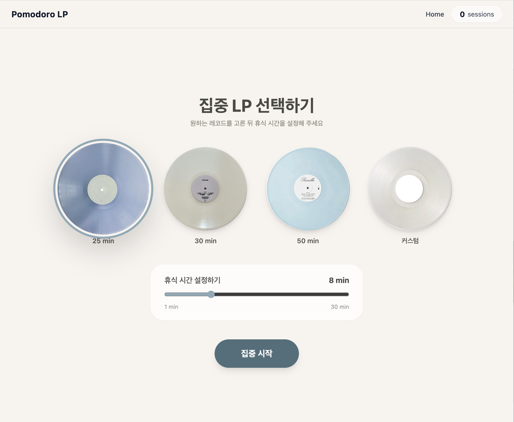
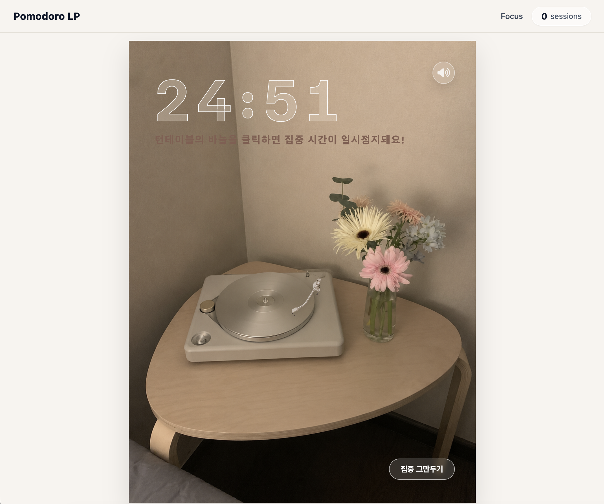
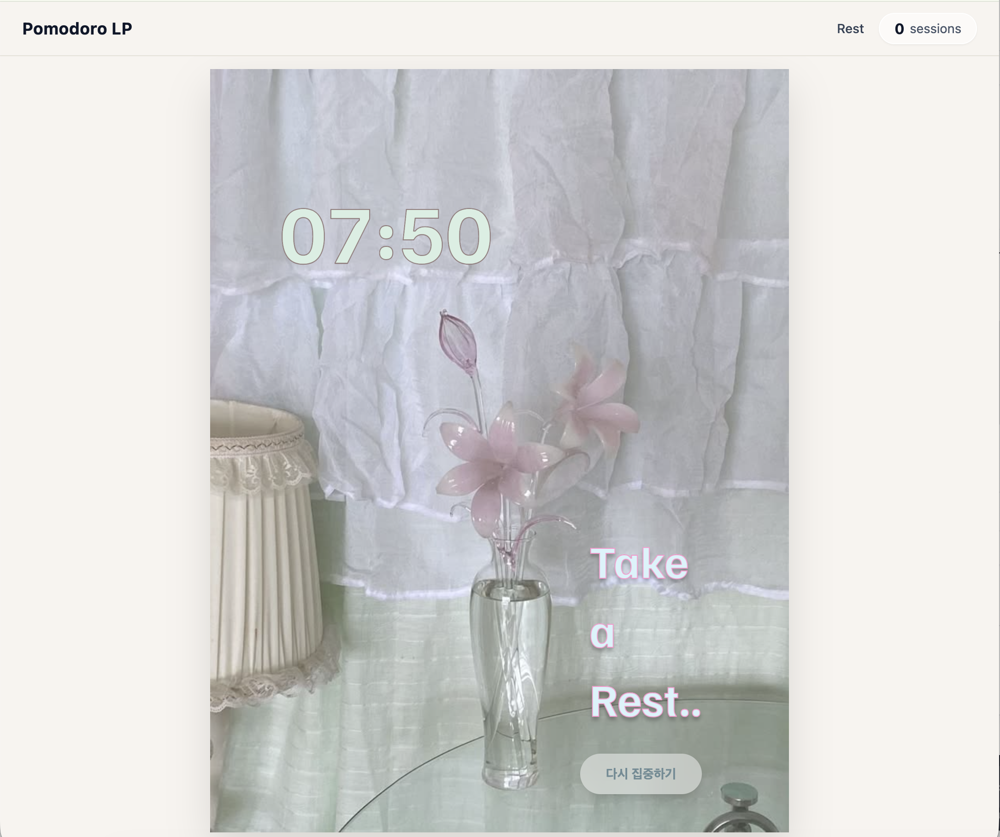

# 3회차 TIL

## 1. 배운 내용

이번 세션에서는 React의 생명주기와 Hook, React Router를 활용한 페이지 이동 방식에 대해 배웠다. 또한 `useState`와 `useEffect`를 활용해 타이머를 구현하고, 시간이 끝났을 때 다른 페이지로 자동으로 이동하는 실습을 하였다.

### 리액트의 생명주기

React 컴포넌트의 생명주기는 `Mount`, `Update`, `Unmount`의 3단계로 이루어진다.

- `Mount`: 컴포넌트가 처음 화면에 나타나는 시점
- `Update`: state나 props가 변경되어 컴포넌트가 다시 렌더링되는 시점
- `Unmount`: 컴포넌트가 화면에서 사라지는 시점

함수형 컴포넌트에서는 이 생명주기 흐름을 `useEffect`를 사용하여 다룰 수 있다.

### useState

`useState`는 컴포넌트 내부에서 상태를 관리할 때 사용하는 Hook이다.

일반 변수는 값이 바뀌어도 화면이 자동으로 바뀌지 않지만, state는 값이 변경되면 React가 이를 감지하고 화면을 다시 렌더링한다.

따라서 카운트, 입력값, 버튼의 열림/닫힘 상태처럼 화면에 반영되어야 하는 값은 `useState`로 관리해야 한다.

또한 `setState`는 값을 즉시 바꾸는 것이 아니라 예약하는 방식으로 동작한다.

그래서 같은 이벤트 안에서 `setState` 직후 state 값을 확인하면 변경 전 값이 나올 수 있다.

### useEffect

`useEffect`는 컴포넌트의 생명주기와 관련된 작업을 처리할 때 사용하는 Hook이다.

### React Router

일반 웹사이트는 페이지마다 HTML 파일이 따로 있지만, SPA는 하나의 HTML 파일 안에서 JavaScript로 화면을 바꾼다.

React는 기본적으로 URL을 인식하지 못하기 때문에, URL에 따라 다른 컴포넌트를 보여주려면 `React Router`가 필요하다.

React Router를 사용하면 새로고침 없이 URL에 맞는 컴포넌트를 렌더링할 수 있다.

- `Link`: 페이지를 이동할 때 사용, `<a>` 태그와 다르게 새로고침이 필요 없다
- `NavLink`: 현재 URL과 일치하면 active 상태가 된다
- `Outlet`: 중첩 라우트에서 부모 레이아웃 안에 자식 페이지를 렌더링할 때 사용한다

### React Router Hook

React Router에서 자주 사용하는 Hook도 배웠다.

- `useParams`: URL에 포함된 동적 파라미터 값을 가져올 때 사용
- `useNavigate`: 특정 조건이 충족되었을 때 페이지가 이동된다

### Tailwind CSS

Tailwind CSS는 별도의 `style.css` 파일을 작성하지 않고 스타일을 적용할 수 있는 방식이다.

기존 CSS는 스타일 파일을 따로 관리해야 하지만, Tailwind CSS는 컴포넌트 안에서 바로 스타일을 확인하고 수정할 수 있다는 장점이 있다

## 2. 핵심 정리

타이머의 표시되는 남은 시간은 화면에 계속해서 반영되어야 하므로 useState로 관리

setInterval, useEffect를 사용해서 시간이 1초마다 줄어들도록 만들었다.

```jsx
useEffect(() => {
  const timer = setInterval(() => {
    setTimeLeft(prev => prev - 1);
  }, 1000);
}, []);
```

React Router를 이용하여 시작, 집중, 휴식 화면을 구분하고, 

useNavigate를 사용하면 타이머가 0초가 되었을 때 자동으로 다음 페이지로 이동하게 할 수 있다.

(사용자가 직접 버튼을 클릭해서 이동할 때는 Link를 사용한다)

## 3. 실습 / 과제 / 결과물







## 4. 느낀 점 / 다음 계획

타이머 구현하는 실습을 통해 React의 생명주기를 조금 더 쉽게 이해할 수 있었다. 처음에는 Mount, Update, Unmount를 개념적으로만 생각했었는데, 타이머를 시작하고, 시간이 줄어들고, 페이지가 이동되는 등으로 생명주기가 어떻게 작동되는지 알게되었다.

또한 Hook과 React Router가 어떻게 작동하는지를 확인해 볼 수 있었다. 페이지 이동에 대해서 어렴풋이만 알고 있었는데, 이번 회차를 통해 리액트에서의 페이지 이동이 어떤 식으로 이루어지는지를 알 수 있었고, 각각 어떤 상황에서 사용되는지도 조금씩 구분할 수 있게 되었다. 

그리고 Tailwind CSS가 무엇이고, 어떤 장점을 가지고 있는지를 알게 되었다. 지금까지는 CSS를 따로 작성하는 방식이 더 익숙했는데, Tailwind CSS뿐만 아니라 다른 방식도 더 찾아보면서 CSS를 작성하는 방법에 대해서도 생각해볼 수 있는 기회가 되었다.