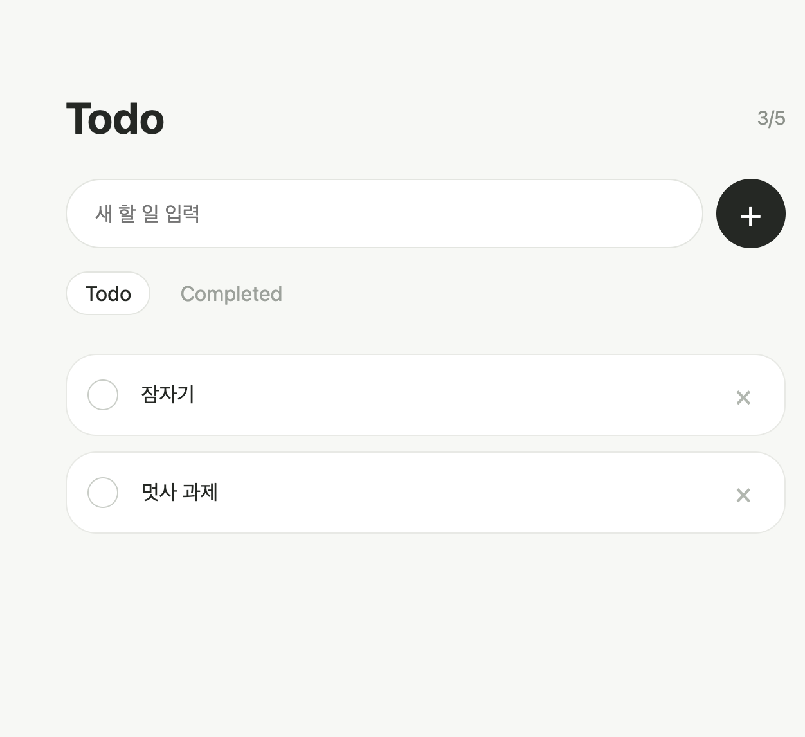
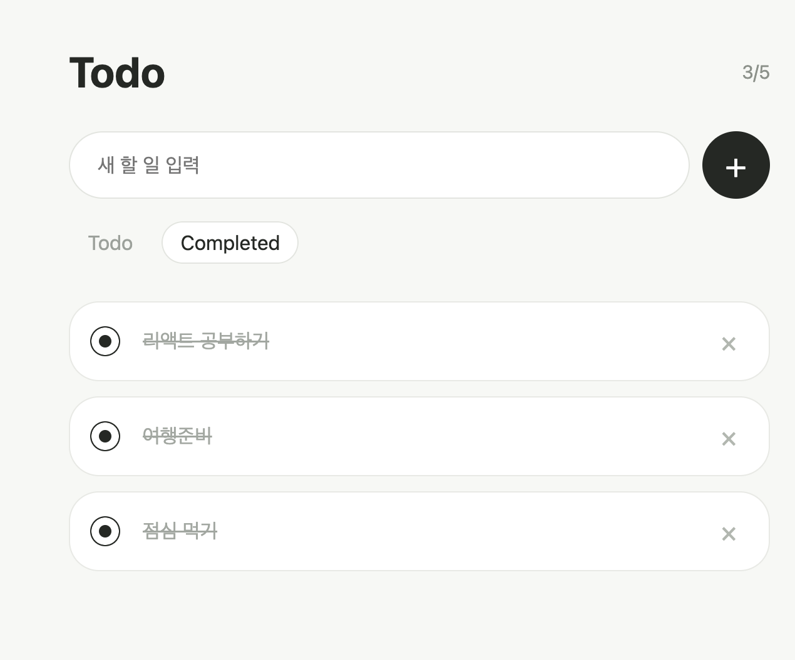

# Today I Learned
## 1. 오늘 배운 내용
- 클라이언트는 서버에 API 요청을 보내고,
- 서버는 클라이언트에 API 응답을 반환하여 통신한다
- Web API 안에 REST / WebSocket 등의 유형이 있다. 
- REST API는 웹 API 아키텍처의 원칙과 설계 방식을 정의한 스타일이다
	- 자원은 URI, 
	- 행위는 HTTP Method로 표현한다.
-  상태코드란?
	- 클라이언트가 서버에 HTTP 요청을 보냈을 때, 서버가 그 요청을 어떻게 처리했는지 숫자로 알려주는 응답 코드이다. 
- JSON은 API에서 데이터를 주고받을 때 많이 사용하는 데이터 형식이다.
- API 명세서를 보면 요청 주소, 메서드, 요청 데이터, 응답 데이터를 미리 확인할 수 있다.


## 2. 핵심 정리 (내 언어로)

### json 서버

- ```db.json``` 파일을 통해 가짜 백엔드 서버를 만든다. 
- 나중에 백엔드가 완성되면 BASE_URL 만 실제 서버 주소로 바꾸면 된다.

### HTTP Method
클라이언트와 서버 간 상호작용을 정의한다
- POST
	- 데이터를 생성할 때 사용
	- 메서드를 명시하고, JSON에 보낸다고 지정하고, 실제 데이터를 추가한다.
	- 할일 추가할 때
- GET
	- 서버에 저장된 데이터를 클라이언트로 가져온다. 
	- 조회의 기능
	- 할일 목록을 불러올 때
- PUT
	- 특정 데이터 / 전체를 변경하고 서버에 반영한다
	- `completed: !todo.completed` 로 현재 상태를 반전시킬 수 있다.
	- 완료 체크 토글
- DELETE
	- 데이터를 삭제할 때 사용
	- 렌더링할 때 불러와야한다. 
	- const fetchTodos = async () => {}
		- 비동기 처리로 UI가 멈추지 않고 
		- 바로바로 처리
	- 할일 삭제할 때

### 상태 코드 Status Code
서버가 요청을 처리한 후 성공 여부를 숫자로 알려준다.
- 2xx : 성공
-  4xx : 클라이언트 오류
-  5xx : 서버 오류


 ``` text
 Input → State (`input`) → Action (Click) → API Request (`POST`) → State Update (`setTodos`) → UI Render
 ```


## 데이터 포맷
서버가 클라이언트에게 데이터를 넘겨주는 형식이다. 
### JSON - 현재 표준
- Key: Value 쌍으로 이루어져 있다.
- 가볍고 빠르다
### XML
- 태그를 사용하여 데이터를 구조화


## 3. 실습 / 과제 / 결과물

 
 


## 4. 느낀점
- 404 Not found 에러가 떴을 때마다 노래만 떠올랐던 내 자신이 생각났다..
- 클라이언트와 서버가 통신하는 과정을 이해하면서, 전체적인 아키텍처의 큰 그림이 그려지는 느낌이었다. 
- 이전에는 에러가 나면 무조건 코드를 수정하는 것에만 집중했었는데, 이제는 HTTP 상태 코드가 어떤 종류의 문제인지를 알려주므로 그것에 더욱 집중해야겠다고 생각했다. 