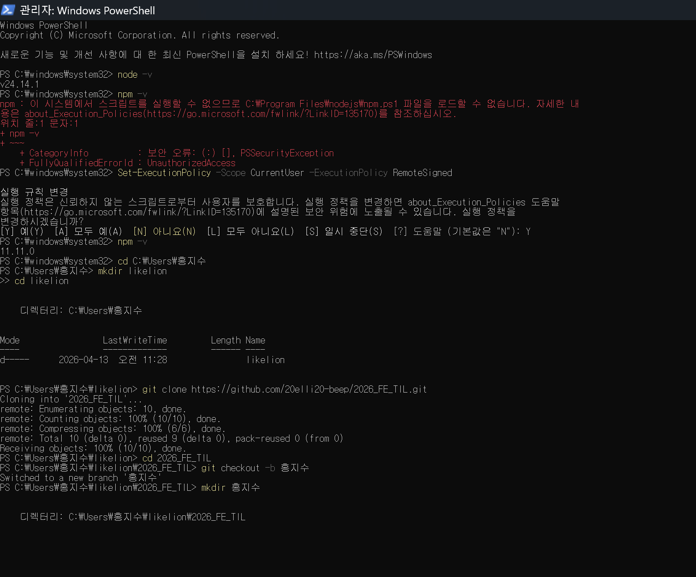
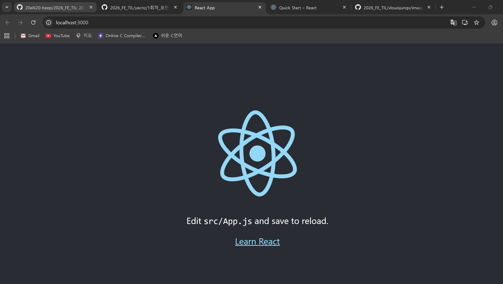
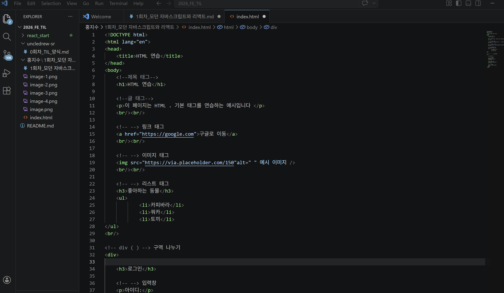
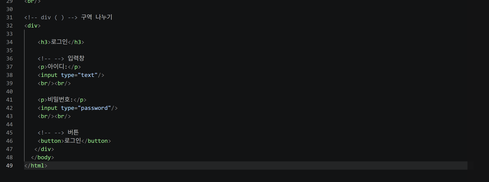

# 📘 Today I Learned

### 1. 오늘 배운 내용

-생성형 AI와 프롬프트 활용:

 -프롬프트 엔지니어링의 중요성: 코드 리팩토링 용이성 및 할루시네이션(환각) 방지.

 -Zero-shot(설명만으로 답변) vs Few-shot(예시를 통한 패턴 학습) 비교.

 -Chain-of-Thought(추론 과정 복제) 및 문맥 강화를 통한 답변 가이드 설정.

 -RTF Framework (Role, Task, Format) 및 RAG(외부 데이터 기반 생성) 이해.

-React 기초 및 특징:

 -사용자 인터페이스 구축을 위한 선언적/효율적/유연한 JS 라이브러리.

 -주요 특징: 컴포넌트 기반 구조, 가상 DOM, 단방향 데이터 바인딩, JSX 문법, React Hooks.

 -UI를 상태 기반으로 자동 관리하여 유지보수 및 DOM 조작의 복잡함 해결.

-브라우저 렌더링 및 Virtual DOM:

 -렌더링 과정: DOM/CSSOM 생성 → Render Tree → Layout → Paint → Composite.

 -JS 조작으로 인한 리플로우/리페인트와 연산 복잡도 이해.

 -Virtual DOM의 원리: 가상 트리 저장 → Diffing(변경 사항 감지) → 최소한의 실제 DOM 업데이트.

-JavaScript의 역할:

 -웹페이지의 동적 변화 및 상호작용 담당(버튼 작동, 애니메이션, 데이터 통신 등).

 -모든 브라우저 내장 엔진 존재 및 서버 없이 동작 가능(새로고침 없는 업데이트).

-Git/Github 협업 및 환경 세팅:

 -개발 환경: Node.js, npm 설치 및 ExecutionPolicy 보안 설정(RemoteSigned).

 -Git 워크플로우: Fork → Clone → Upstream 연결 → Branch 생성 → Commit/Push → PR 전송.

### 2. 핵심 정리 (내 언어로)

-프롬프트 최적화: 

 AI에게 단순히 질문하기보다 RTF(역할, 작업, 형식)를 지정하고Few-shot으로 구체적인 예시 를 심어주면 답변의 질이 확연히 달라짐. 알고 있던 프롬프팅 기법 중 하나인 페르소나 설정에 더해 구체적인 예시 데이터의 힘을 다시 느낌.

-React와 가상 DOM: 

 식물이 시들었다고 밭 전체를 갈아엎는 비효율적인 방식 대신, 시든 잎사귀만 골라 따주듯 바뀐 데이터만 골라 업데이트하는 가상 DOM 덕분에 웹이 훨씬 가볍고 빠르게 돌아감. 컴포넌트 단위로 쪼개어 관리하니 레고 조립하듯 개발이 구조적임.

-브라우저의 속사정:

 우리가 코딩만 하는 코더가 아니라 성능을 고민하는 개발자가 되려면, 화면 하나가 그려지기 위해 브라우저 내부에서 일어나는 복잡한 렌더링 과정을 이해하는 것이 필수적임.나무보다는 숲을 보자아..(?)

-Git 협업: 

 중앙(메인 브랜치)에 있는 팀 프로젝트를 내 계정으로 복사(fork)해오고, 내 컴퓨터에 다운로드(Clone)해서 '내 이름' 폴더에서 작업하는 과정. 다 하면 다시 합쳐달라고 요청(PR)하는 거 잊지 말기..갠적으로 요게 제일 어려웠는데 해결하고 나니 속이 시~원~하당!

-Javascript:

 프로그래밍 언어로 웹페이지를 동적으로 변화시켜줌. 동적인 UI를 구현할 수 있어서  HTML과의 차이가 돋보임.

### 3. 실습 / 과제 / 결과물

 제미나이 쓰앵님의 도움을 많이 받아서 친 코드긴 하지만 차근차근 사소한 것(조금만 몰라도 질문했습니당)도 질문하고 끝냈다는것에 의의를 둡니둥..!(같은 프론트엔드 아기사자인 현우님 깃허브 TIL도 조금 참고했어요..ㅎㅎ)

1. React 환경 세팅

- 코드: `node -v`, `npm -v`, `git clone`, `git checkout` 실습..(?) 
- 링크: https://github.com/20elli20-beep/2026_FE_TIL.git
- 스크린샷:

 
 

2. HTML & CSS 실습 

- 코드: index.html (기초 자료의 제목 태그, 리스트, 입력 폼 활용 실습)
- 링크: https://vscode.dev/github/20elli20-beep/2026_FE_TIL/blob/%ED%99%8D%EC%A7%80%EC%88%98/%ED%99%8D%EC%A7%80%EC%88%98/1%ED%9A%8C%EC%B0%A8_%EB%AA%A8%EB%8D%98%20%EC%9E%90%EB%B0%94%EC%8A%A4%ED%81%AC%EB%A6%BD%ED%8A%B8%EC%99%80%20%EB%A6%AC%EC%95%A1%ED%8A%B8/index.html
- 스크린샷: 

### 4. 느낀 점 & 다음 계획

-느낀점: 

 2025년 기초과학연구소 프로젝트를 수행하며 프롬프팅 페르소나 설정 등 생성형 AI 활용법을 접해본 적이 있어 이번 세션이 무척 반가웠다. 하지만 이미 알고 있던 지식에 새로운 개발 개념들이 더해지니 또 다른 신선한 자극이 되었다.
 사실 처음에는 터미널 아이콘(>_)이 윙크하는 귀여운 이모티콘인 줄로만 알았는데, 파워쉘 설정이나 관리자 권한 같은 생소한 용어들이 쏟아져 잠시 당황하기도 했다. 배포된 기초 자료를 미리 공부하며 준비했음에도 불구하고, 눈으로 읽을 때와 달리 실제 실습에서 몸이 바로 따라주지 않아 속상한 마음이 컸다. 특히 운영지원팀으로서 나의 부족함 때문에 세션 진도가 늦어지는 것 같아 동료들에게 미안한 마음이 들었지만, 세션 종료 후 AI와 소통하며 에러를 하나씩 해결해 나갔다. 결국 터미널에 11.11.0이라는 숫자가 떴을 때 느낀 쾌감은 정말 잊지 못할 것 같다. 이제 막 첫걸음을 뗐으니, 조급함을 내려놓고 차근차근 익혀나가려 한다.

-다음 계획: 

 우선 당면한 시험 기간이 종료되면 VOD 강의를 완강할 계획이다. 2회차 세션에서는 팀원들에게 짐이 되지 않고 당당히 제 역할을 해내고 싶기 때문이다. 리액트 구조를 복습하며 포털 사이트의 메인 외에 다른 페이지들까지 스스로 클론 코딩해 보는 것을 목표로 삼았다. 단순히 코드를 받아 적는 것이 아니라, "왜 여기서 이 코드가 쓰였지?"라는 질문을 끊임없이 던지며 개발의 근본적인 원리를 파악하는 습관을 기르고 싶다.
